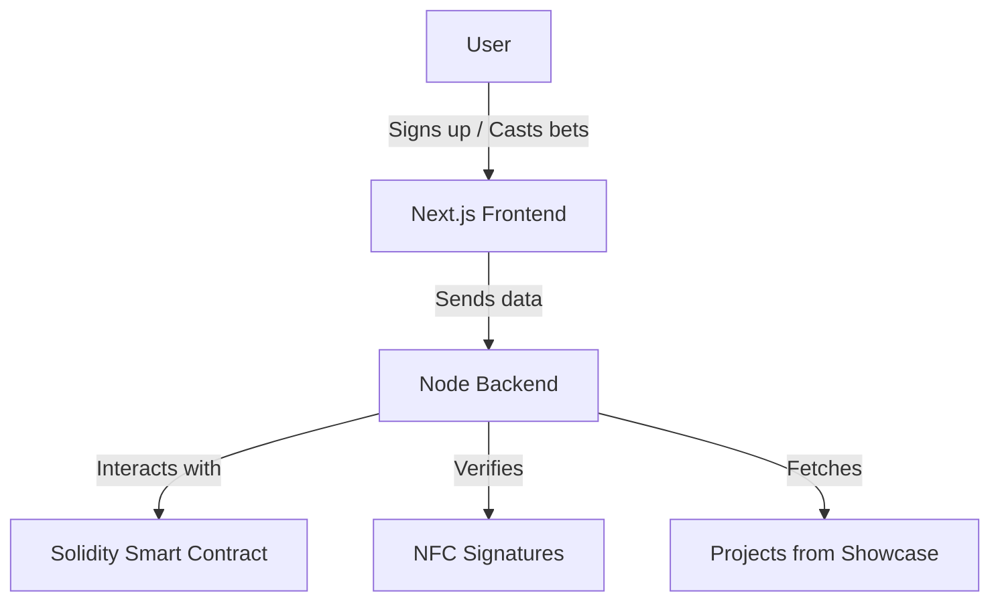
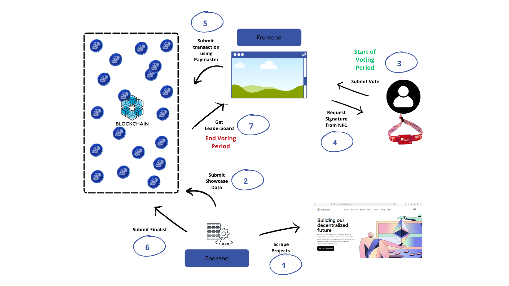

# BananaBets

THIS PROJECT IS ONLY USABLE ON MOBILE.

Betting platform where ETHGlobal attendees can forecast hackathon finalists based on showcase data and sign in with their NFC wristbands for frictionless onboarding.

## ⁉️ Description
We discovered that project submissions on ethglobal.com/showcase are accessible before the finalists are announced. Leveraging this insight, we created a platform for ETHGlobal Brussels attendees to bet on which projects will become finalists prior to the winner ceremony.

Each bettor can cast a number of votes to bet on different projects they believe will be finalists via our frontend. After the results are announced, incorrect bets incur negative points while correct bets earn positive points. A leaderboard is then generated, and the top scorer wins 100 USDC.

Attendees can easily join by scanning their NFC wristbands and betting transactions are signed directly by their NFC private keys.

## 📦 How it's made

## 💻 Technical Preview

## Explanation of the steps

1. Our backend scrapes the ETHGlobal Brussels projects from the ETHGlobal showcase website.
2. Backend assigns unique IDs to each project and submits all of the IDs in an array to our smart contract on the ApeChain testnet.
3. Backend starts the voting period by calling the contract. Users can now go to our website, select projects that they think will be selected as finalists and submit their votes by clicking on the "submit vote"-button.
4. To make sure the user is an ETHGlobal Brussels attendee and to ensure frictionless onboarding, the user is prompted to scan his NFC wristband with his phone. SUBMISSION OF VOTES VIA DESKTOP WILL NOT WORK. The NFC wristband will sign a message containing the voting data collected in step 3.
5. The signed message is then sent to the backend, where a mock-paymaster will wrap the message in a transaction object and submit it to the contract.
6. Shortly before the finalists are announced, voting will be closed by the backend by calling the contract. Also, the finalist project IDs will be submitted in an array to the contract after the finalists are public.
7. Based on the correctness of their votes, each user will be assigned a number of points when the getLeaderboard contract function is called. The leaderboard is then displayed on our website for everyone to see. The user with the most points will receive 100 USDC after contacting us.
